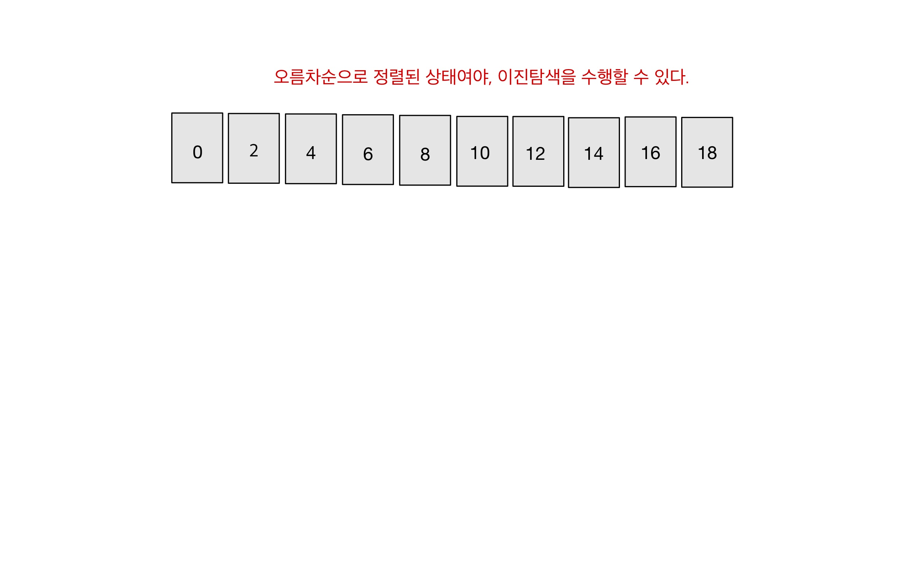
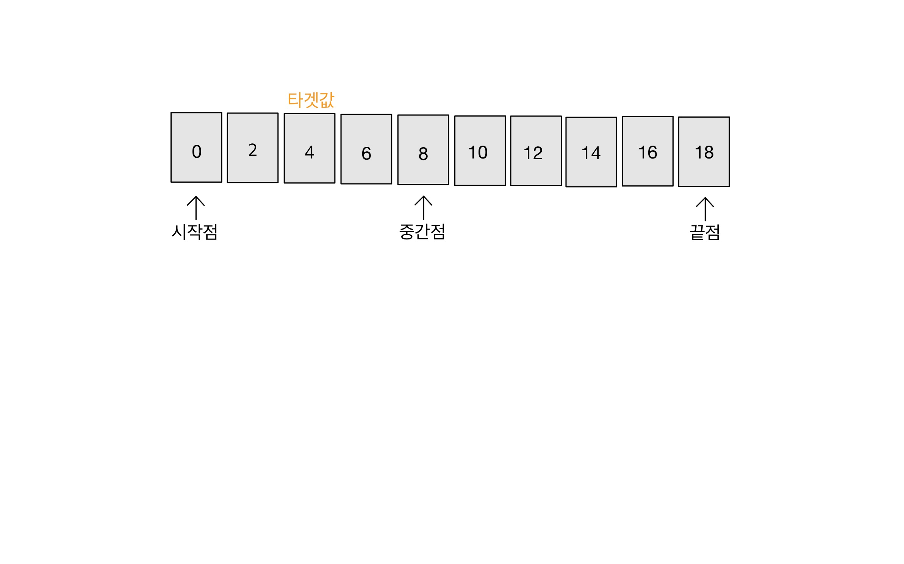
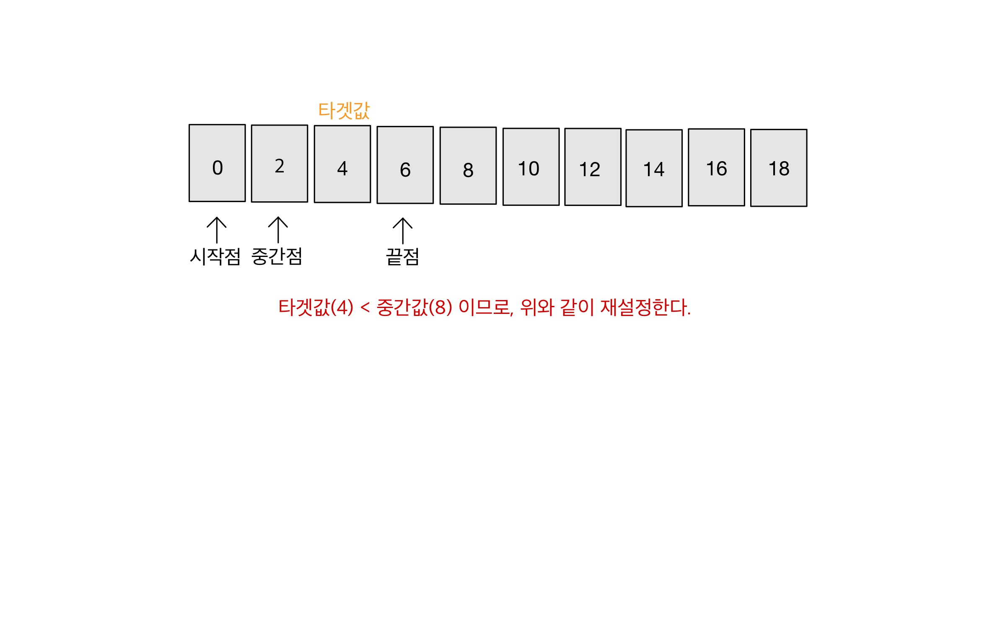
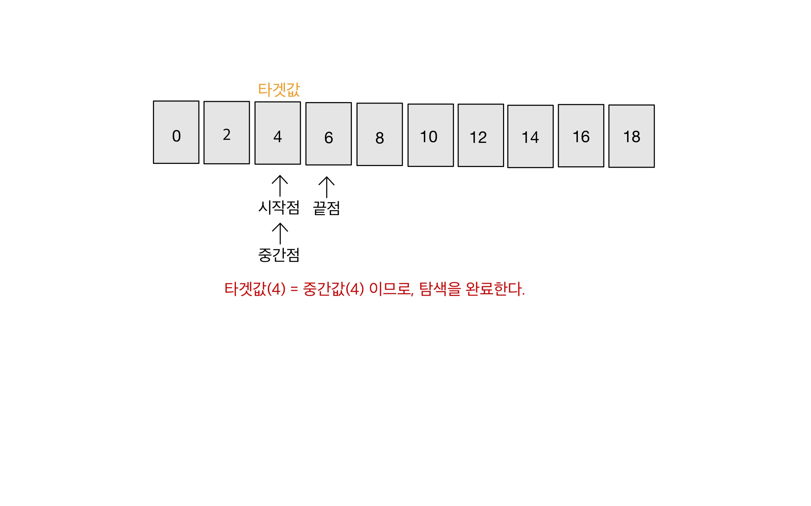

# 이진탐색
## 개요
### 이진탐색이란?
- 배열 내부의 데이터들 중, 특정 데이터를 찾아내는 알고리즘이다.
- 배열 내부의 데이터가 정렬되어 있어야만 사용할 수 있는 알고리즘이다.
- 이진 탐색은 위치를 나타내는 변수 3개를 사용한다.
  - 탐색 범위의 시작점
  - 탐색 범위의 끝점
  - 탐색 범위의 중간점
- **찾으려는 데이터와 중간점 위치에 있는 데이터를 반복적으로 비교해서 원하는 데이터를 찾아내는 것이 이진 탐색 과정이다.**

<br/>

### 이진탐색 동작 과정
1. 탐색 범위의 시작점, 끝점, 중간점을 설정한다.
    - 중간점 = (시작점+끝점)/2
    - 중간점이 실수 형태인 경우, 소수점 이하는 버린다.
2. 찾으려는 값(target)과 중간점에 위치한 값을 비교한다.
    - `target 값 > 중간점의 값` : 3번을 수행한다.
    - `target 값 < 중간점의 값` : 4번을 수행한다.
    - `target 값 = 중간점의 값` : 5번을 수행한다.
3. 시작점, 끝점, 중간점을 아래와 같이 설정한다. 그리고 2번으로 돌아간다.
    - 시작점 = '이전의 중간점' + 1
    - 끝점 = 변경 X
    - 중간점 = ('이전의 중간점' + '끝점' + 1) / 2
        > 이때 소수점 이하는 버린다.
4. 시작점, 끝점, 중간점을 아래와 같이 설정한다. 그리고 2번으로 돌아간다.
    - 시작점 = 변경 X
    - 끝점 = '이전의 중간점' - 1
    - 중간점 = ('이전의 중간점' + '시작점' - 1) / 2
      > 이때 소수점 이하는 버린다.
5. target값을 찾아냈으므로 알고리즘을 종료한다.

<br/><br/>

## 예시
### 예시에서 사용할 배열 형태


### Step 01


### Step 02


### Step 03


<br/>

### 결과
- 타겟값(4)가 index 2번에 존재함을 알아낼 수 있다.
  - 이때 타겟값의 index은 중간점과 같다.

<br/>

### 특징
- 이진 탐색을 이용해 총 3번의 탐색으로 원소를 찾을 수 있다.
- 이진 탐색은 한번 확인할 때마다 확인하는 원소의 개수가 절반씩 줄어든다는 점에서 시간 복잡도가 `O(logn)`이다.
- 이진탐색을 구현하는 방법에는 2가지가 존재한다.
  - 재귀함수를 사용하는 방법
  - 반복문을 사용하는 방법

## 소스코드 - 재귀 방식
### 이진탐색 알고리즘
```java
public class 이진탐색_재귀 {

  private static void solution(int[] n, int start, int end, int middle, int target) {

    if (start == end && n[middle] != target) {
      System.out.println("찾으려는 값이 존재하지 않습니다.");
      return;
    }

    if (n[middle] < target) {
      solution(n, middle+1, end, (middle+1+end)/2, target);
    } else if (n[middle] > target) {
      solution(n, start, middle - 1, (start + middle - 1) / 2, target);
    } else {
      System.out.println(middle);
      return;
    }

  }

  public static void execute() {
    int[] n = {0, 2, 4, 6, 8, 10, 12, 14, 16, 18};
    solution(n, 0, 9, 9/2, 5);
  }
}

```

<br/>

### 출력결과
```text
2
```

<br/><br/>

## 소스코드 - 반복문 방식
### 이진탐색 알고리즘
```java
public class 이진탐색_반복문 {

  private static void solution(int[] n, int target) {
    int start = 0;
    int end = n.length - 1;
    int middle = (start+end)/2;

    while (true) {

      if (start == end && n[middle] != target) {
        System.out.println("찾으려는 값이 존재하지 않습니다.");
        return;
      }

      if (n[middle] > target) {
        end = middle - 1;
        middle = (start + end) / 2;
      } else if (n[middle] < target) {
        start = middle + 1;
        middle = (start+end) / 2;
      } else if (n[middle] == target) {
        break;
      }
    }

    System.out.println(middle);

  }

  public static void execute() {
    int[] n = {0, 2, 4, 6, 8, 10, 12, 14, 16, 18};
    solution(n, 5);
  }
}

```

<br/>

### 출력결과
```text
2
``` 