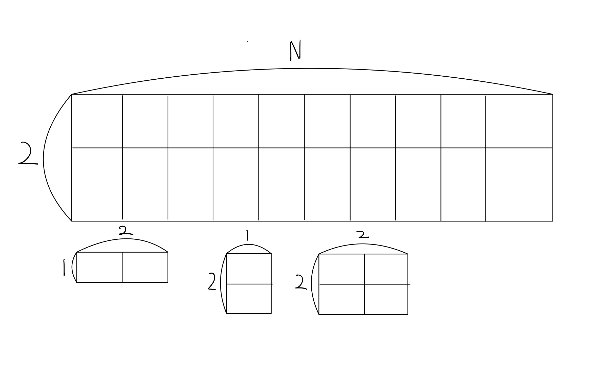
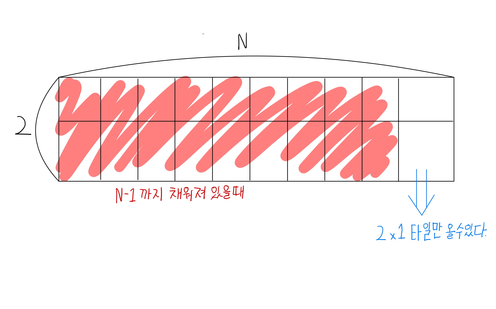
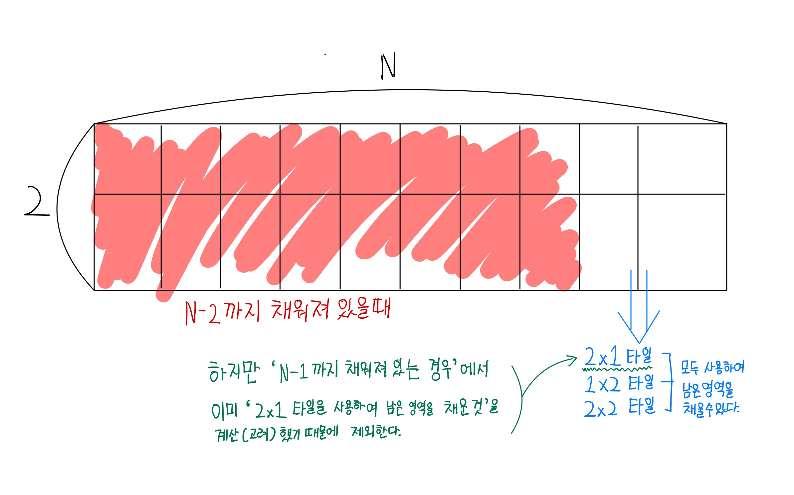

# 바닥 공사
## 문제
### 문제 정의

- 가로의 길이가 N, 세로의 길이가 2인 직사각형 형태의 얇은 바닥이 있다.
- 태일이는 이 얇은 바닥을 1x2의 덮개, 2x1의 덮개, 2x2의 덮개를 이용해 채우고자 한다.
  - 바닥: Nx2
    
    ||||||
    |---|---|---|---|---|
    | | | | | |
  - 1x2 덮개
    
    |||
    |---|---|
  - 2x1 덮개

    ||
    |---|
    | |
  - 2x2 덮개

    |||
    |---|---|
    |||

- 이때 바닥을 채우는 모든 경우의 수를 구하는 프로그램을 작성하시오.
- 예시
  - 2x3 크기의 바닥을 채우는 경우의 수는 5가지이다.

<br/>

### 입력조건
- 첫째 줄에 정수 N이 주어진다.
    - N: 1 이상, 1,000 이하

<br/>

### 출력조건
- 첫째 줄에 2xN 크기의 바닥을 채우는 방법의 수를 796,796으로 나눈 나머지를 출력한다.

<br/>

### 입·출력 예시
- 입력
  ```text
  3
  ```

- 출력
  ```text
  5
  ```

<br/>

## 풀이
### 문제 해설
- 문제 풀이를 위해 도식화해보자.
    
    
    
- 이것을 점화식으로 표현하면 아래와 같다.  
  
    -  : ix2 영역을 채우는 모든 경우의 수

<br/>

### 소스코드
```java
public class 바닥_공사 {

  static int[] d = new int[1000];

  private static int solution1(int n) {
    //d[n] = n*2의 영역을 채우는 경우의 수
    d[0] = 0;
    d[1] = 1;
    d[2] = 3;

    for (int i = 3; i <= n; i++) {
      d[i] = (d[i-1] + 2*d[i-2])%796796;
    }

    return d[n];
  }

  public static void execute() throws Exception {
    BufferedReader bf = new BufferedReader(new InputStreamReader(System.in));
    int n = Integer.parseInt(bf.readLine());

    TimeCheck.start();

    int answer = solution1(n);

    TimeCheck.end();

    System.out.println(answer);
  }
}

```