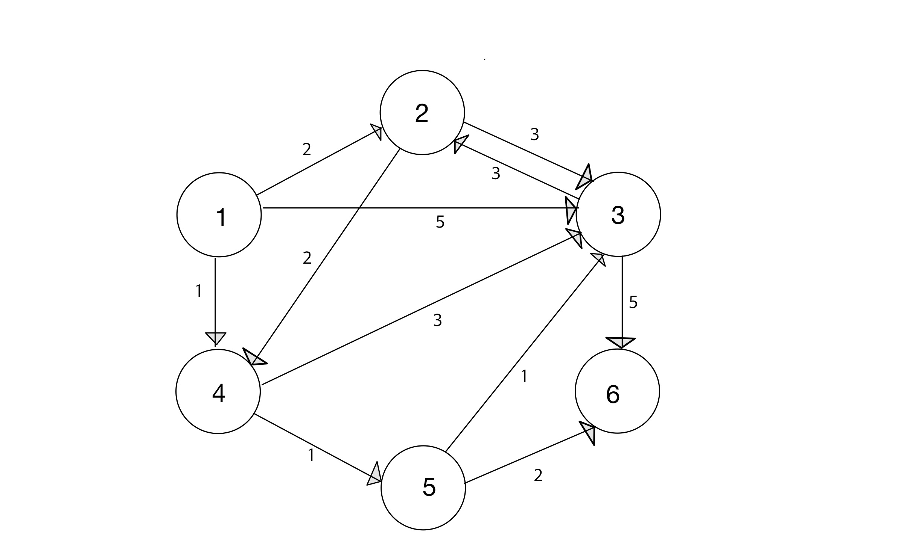
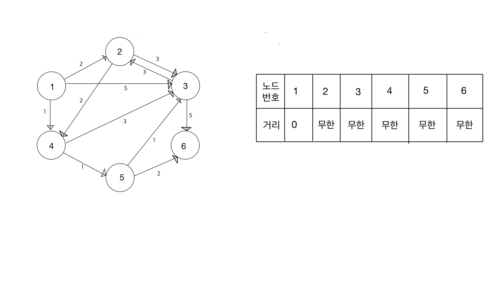
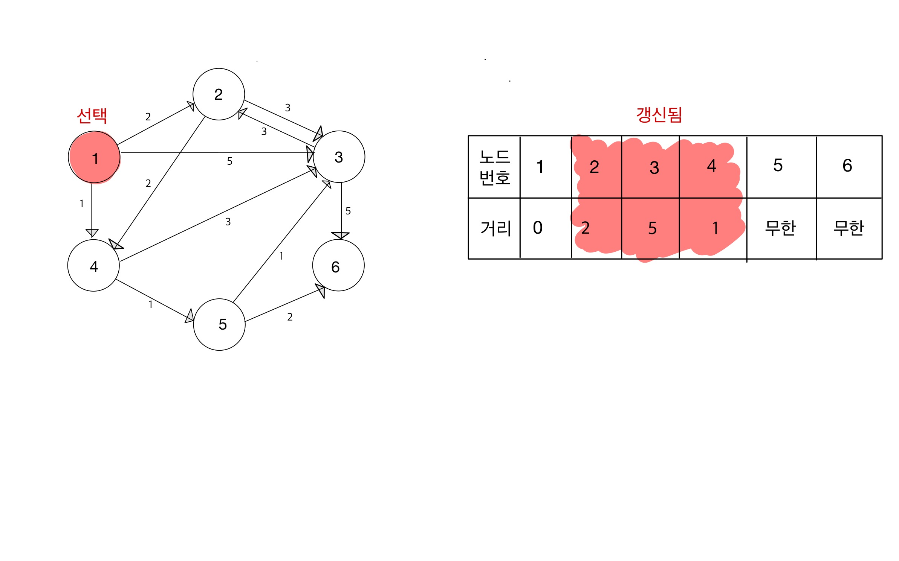
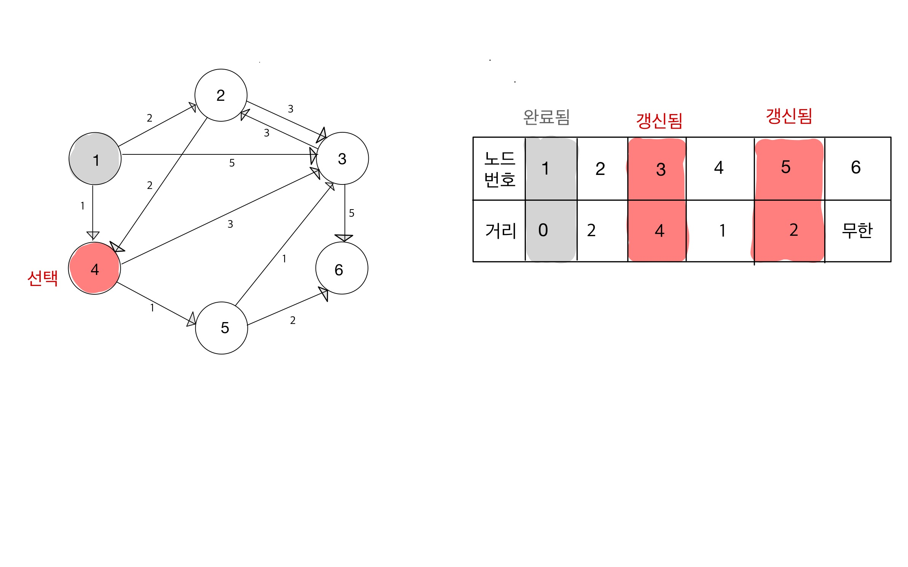
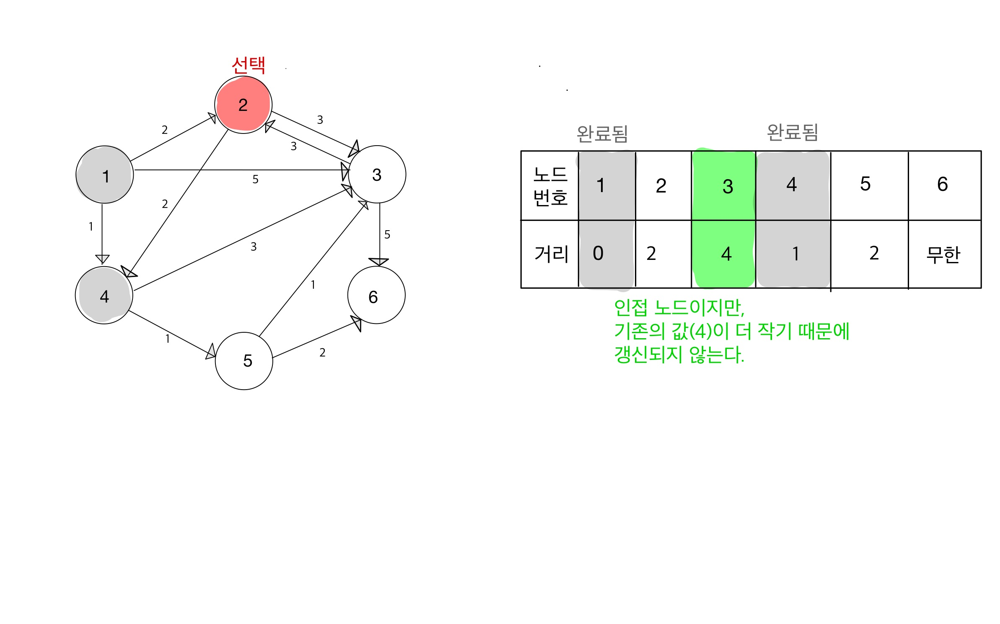
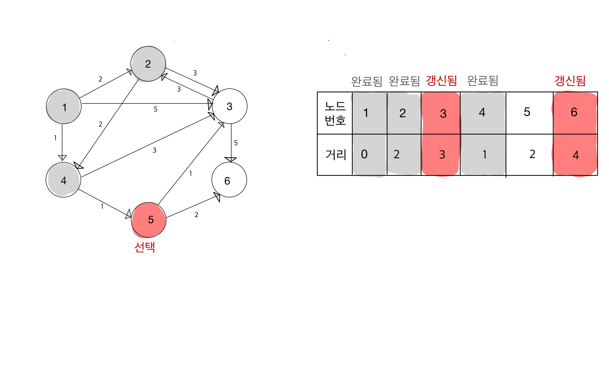
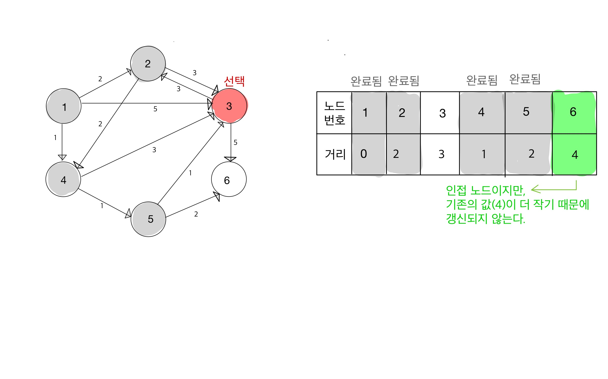
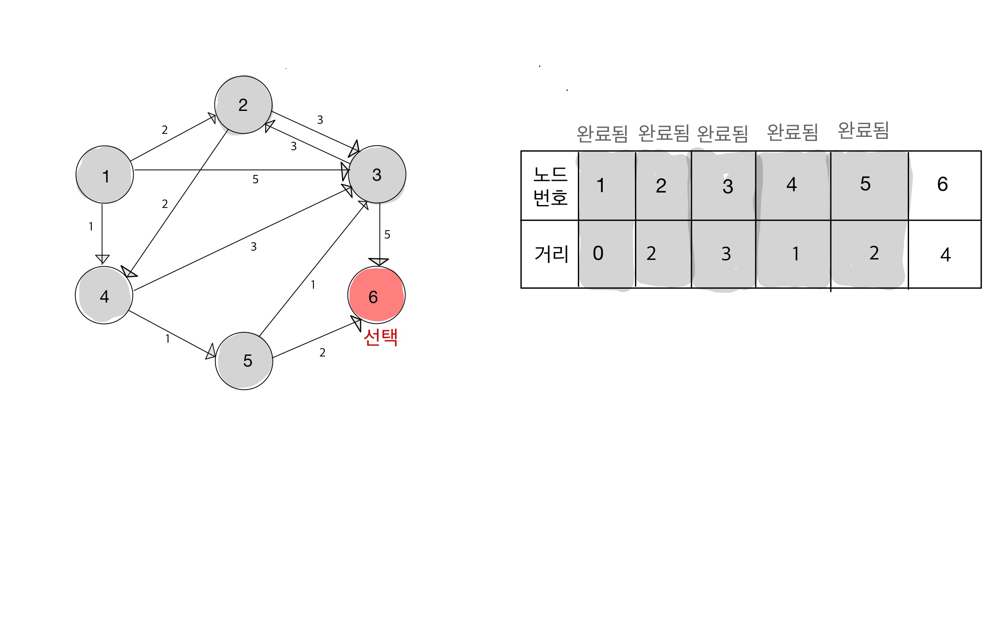
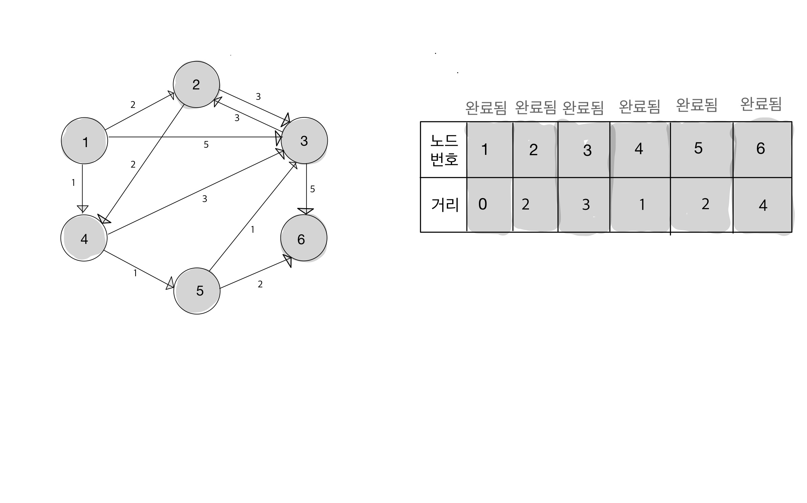

# 다익스트라 알고리즘
## 개요
### 최단 경로 알고리즘이란?
- 가장 짧은 경로를 찾는 알고리즘이다.
- 최단 경로 문제는 보통 그래프를 이용해서 표현한다.
- 대표 알고리즘
  - 다익스트라 알고리즘
  - 플로이드 워셜 알고리즘
> 실제 코딩 테스트에서는 최단 경로를 모두 출력하는 문제보단, **단순히 최단 거리를 출력하도록 요구하는 문제**가 많이 출제된다.

<br/>

### 다익스트라 알고리즘이란?
- 그래프에서  여러 개의 노드가 있을 때, 특정한 노드에서 출발하여 다른 노드로 가는 각각의 최단 경로를 구해주는 알고리즘이다.
- 다익스트라 최단 경로 알고리즘은 **음의 간선이 없을 때 정상적으로 동작**한다.
  - 음의 간선: 0보다 작은 값을 가지는 간선(Edge)
- 현실 세계의 길(간선)은 음의 간선으로 표현되지 않으므로 다익스트라 알고리즘은 실제로 GPS 소프트웨어의 기본 알고리즘으로 채택된다.
- 다익스트라 최단 경로 알고리즘은 기본적으로 **그리디 알고리즘**으로 분류된다.

<br/>

### 다익스트라 알고리즘 동작 방식
1. 출발 노드를 설정한다.
2. 최단 거리 테이블을 초기화한다.
3. 방문하지 않은 노드 중에서 최단 거리가 가장 짧은 노드를 선택한다.
4. 해당 노드를 거쳐 다른 노드로 가는 비용을 계산하여 최단 거리 테이블을 갱신한다.
5. 위 과정에서 3번과 4번을 반복한다.

<br/>

### 특징
- 다익스트라 알고리즘은 '각 노드에 대한 현재까지의 최단 거리' 정보를 항상 1차원 리스트에 저장하며 리스트를 계속 갱신한다.
  - 매번 현재 처리하고 있는 노드를 기준으로 주변 간선을 확인한다.
  - 나중에 현재 처리하고 있는 노드와 인접한 노드로 도달하는 더 짧은 경로를 찾으면 그것을 제일 짧은 경로로 판단한다.
- 따라서 다익스트라 알고리즘은 **그리디 알고리즘**의 일종으로 취급할 수 있다.

<br/>

### 다익스트라 알고리즘 구현 방식
- 다익스트라 알고리즘을 구현하는 방식에서 총 2가지 방법이 있다.
  - 방법 1. 구현하기 쉽지만 느리게 동작하는 코드
  - 방법 2. 구현하기에 조금 더 까다롭지만 빠르게 동작하는 코드
> **코딩 테스트를 위해선, 방법 2를 정확히 이해하고 구현할 수 있을 때까지 연습해야 한다.**

<br/><br/>

## 동작 예시
### 예시에서 사용할 그래프 형태


<br/>

### Step 01

- 출발 노드에서 출발 노드로의 거리는 0이다.

<br/>

### Step 02

- 방문하지 않은 노드 중에서 최단 거리가 가장 짧은 노드를 선택한다.
- 그리고 `'시작 노드'부터 '선택된 노드에서 갈 수 있는 노드'까지의 거리` 와 `테이블에 저장되어 있는 값` 끼리 비교한다.
- `'시작 노드부터 갈 수 있는 노드'까지의 거리`가 더 작다면 `'시작 노드부터 갈 수 있는 노드'까지의 거리`으로 갱신한다.
- 위 그림에선 '무한'보다 모두 짧으므로 전부 갱신된다.

<br/>

### Step 03

- 선택했던 노드를 방문 처리한다.
- 다시, 방문하지 않은 노드 중 최단 거리가 가장 짧은 노드를 선택한다.
- 그리고 `'시작 노드'부터 '선택된 노드에서 갈 수 있는 노드'까지의 거리` 와 `테이블에 저장되어 있는 값` 끼리 비교한다.
- `'시작 노드부터 갈 수 있는 노드'까지의 거리`가 더 작다면 `'시작 노드부터 갈 수 있는 노드'까지의 거리`으로 갱신한다.

<br/>

### Step 04

- 선택했던 노드를 방문 처리한다.
- 다시, 방문하지 않은 노드 중 최단 거리가 가장 짧은 노드를 선택한다.
  > 거리가 같을 땐, 더 앞에 있는 노드를 선택한다.
- 그리고 `'시작 노드'부터 '선택된 노드에서 갈 수 있는 노드'까지의 거리` 와 `테이블에 저장되어 있는 값` 끼리 비교한다.
- `'시작 노드부터 갈 수 있는 노드'까지의 거리`가 더 작다면 `'시작 노드부터 갈 수 있는 노드'까지의 거리`으로 갱신한다.
- 위 그림에선 `1 -> 2 -> 3`으로 갈 때의 거리 '5'보다  
  기존의 `1 -> 4 -> 3` 방식의 거리 '4'가 더 작기 때문에, 갱신하지 않는다.

<br/>

### Step 05


<br/>

### Step 06


<br/>

### Step 07


<br/>

### Step 08


<br/>

### 특징
- 최단 거리 테이블이 의미하는 바는 1번 노드로부터 출발했을 때 2번, 3번, 4번, 5번, 6번 노드까지 가기 위한 최단 경로가 각각 2, 3, 1, 2, 4라는 의미이다.
- 그리고 '방문하지 않은 노드 중에서 가장 최단 거리가 짧은 노드를 선택'하는 과정을 반복한다.
- 이렇게 선택된 노드는 '최단 거리'가 완전히 선택된 노드이므로, 더 이상 알고리즘을 반복해도 최단 거리가 줄어들지 않는다.
- **즉 다익스트라 알고리즘이 진행되면서 한 단계당 하나의 노드에 대한 최단 거리를 확실히 찾는 것으로 이해할 수 있다.**

<br/><br/>

## 소스코드
### 다익스트라 알고리즘
```java
public class 다익스트라_기본 {
  static boolean[] isVisitedNode = new boolean[100001]; //방문한 노드인지 (isVisitedNode[i] = i번째 노드를 방문한적 있는지)
  static int[] shortestTable = new int[100001]; //최단거리 테이블 (shortedTable[i] = startNode에서 i노드까지의 최단 거리)
  static int sizeOfVertex; //노드개수
  static int sizeOfEdge; //간선개수
  static int startNode; //시작노드(index)
  static ArrayList<ArrayList<Node>> graph = new ArrayList<>(); //그래프

  /**
   * 실행 메서드
   */
  public static void execute() throws Exception {
    BufferedReader bf = new BufferedReader(new InputStreamReader(System.in));
    String s = bf.readLine();
    StringTokenizer st = new StringTokenizer(s);
    sizeOfVertex = Integer.parseInt(st.nextToken());
    sizeOfEdge = Integer.parseInt(st.nextToken());
    startNode = Integer.parseInt(bf.readLine());
    for (int i = 0; i <= sizeOfVertex; i++) {
      graph.add(new ArrayList<Node>());
    }

    for (int i = 0; i < sizeOfEdge; i++) {
      s = bf.readLine();
      st = new StringTokenizer(s);
      int fromNode = Integer.parseInt(st.nextToken());
      int toNode = Integer.parseInt(st.nextToken());
      int weight = Integer.parseInt(st.nextToken());
      graph.get(fromNode).add(new Node(toNode, weight));
    }

    solution();

    for (int i = 1; i <= sizeOfVertex; i++) {

      //시작노드에서 도달할 수 없는 노드인 경우
      if (shortestTable[i] == Integer.MAX_VALUE) {
        System.out.println("INFINITE");
      } else {
        System.out.println(shortestTable[i]);
      }
    }
  }

  /**
   * 다익스트라 알고리즘 수행 메서드
   */
  private static void solution() {
    Arrays.fill(shortestTable, Integer.MAX_VALUE);

    // 시작 노드에 대해 초기화
    shortestTable[startNode] = 0;
    isVisitedNode[startNode] = true;
    for (int i = 0; i < graph.get(startNode).size(); i++) { //시작 노드와 인접한 노드들에 대한 shortest 테이블 값 설정
      shortestTable[graph.get(startNode).get(i).getNodeNum()] = graph.get(startNode).get(i).getDistance();
    }

    // 시작 노드를 제외한 전체 n-1 개의 노드에 대해 반복한다.
    for (int i = 0; i < sizeOfVertex - 1; i++) {
      int currentNode = getShortestNode(); //시작노드로부터 가장 거리가 짧은 노드 구하기
      isVisitedNode[currentNode] = true; //방문 처리

      //현재 노드와 인접한 노드들 확인 (시작노드와 인접노드 간의 최소거리 구하기)
      for (int u = 0; u < graph.get(currentNode).size(); u++) {
        int distanceBetweenCurrentNodeAndNearNode = graph.get(currentNode).get(u).getDistance(); //'현재노드'와 '인접 노드' 간의 거리
        int distanceBetweenStartNodeAndNearNode = shortestTable[currentNode] + distanceBetweenCurrentNodeAndNearNode; //'시작노드'와 '인접 노드' 간의 거리

        if (shortestTable[graph.get(currentNode).get(u).getNodeNum()] > distanceBetweenStartNodeAndNearNode) {
          shortestTable[graph.get(currentNode).get(u).getNodeNum()] = distanceBetweenStartNodeAndNearNode;
        }
      } //내부 for문 종료

    } //외부 for문 종료
    
  }

  /**
   * 방문하지 않은 노드 중에서,
   * 가장 최단 거리가 짧은 노드의 번호를 반환하는 메서드
   */
  private static int getShortestNode() {
    int min_value = Integer.MAX_VALUE;
    int index = 0; // 가장 최단 거리가 짧은 노드 (인덱스)

    for (int i = 1; i <= sizeOfVertex; i++) {
      if (shortestTable[i] < min_value && !isVisitedNode[i]) {
        min_value = shortestTable[i];
        index = i;
      }
    }

    return index;
  }

  
  /**
   * 노드 클래스
   */
  private static class Node {
    private int nodeNum;
    private int distance;

    public Node(int nodeNum, int distance) {
      this.nodeNum = nodeNum;
      this.distance = distance;
    }

    public int getNodeNum() {
      return nodeNum;
    }

    public int getDistance() {
      return distance;
    }
  }
}

```

<br/>

### 시간복잡도
- 위 알고리즘은 `O(V^2)`의 시간복잡도를 갖는다.
  - `V` : 노드 개수
- 왜냐하면 **각 단계마다 '방문하지 않은 노드 중에서 최단 거리가 가장 짧은 노드를 선택'하기 위해, 매 단계마다 1차원 리스트의 모든 원소를 확인 (순차 탐색)** 하기 때문이다.
  - 즉 `O(V)`번에 걸쳐서 최단 거리가 가장 짧은 노드를 매번 선형 탐색해야 하고,  
    현재 노드와 연결된 노드를 매번 일일이 확인하여 거리를 계산하기 때문이다.
- 따라서 다익스트라 알고리즘의 속도를 높히려면, '개선된 다익스트라 알고리즘'을 사용해야 한다.

<br/>

## Tip
- 왜 1차원 리스트에는 '최단 거리'만을 저장할까? 경로를 저장하지 않고?
  - 보통 코딩 테스트에서는 특정한 노드에서 다른 특정한 노드까지의 최단 거리만을 출력하도록 요청하기 때문이다.