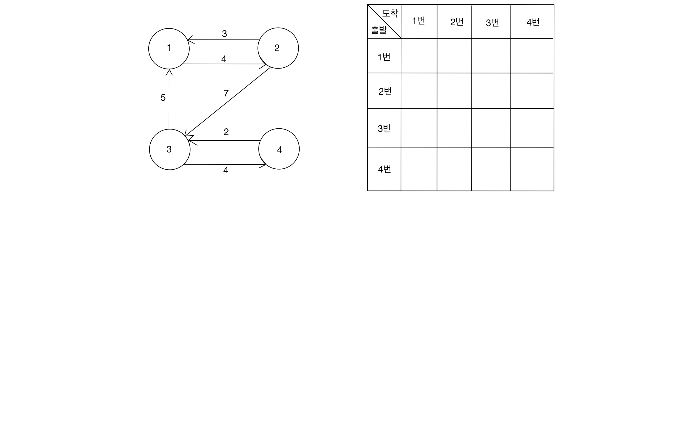
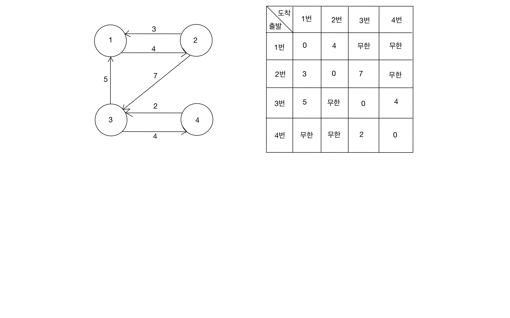
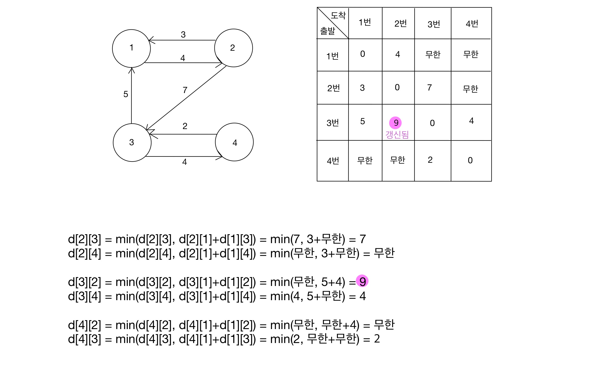
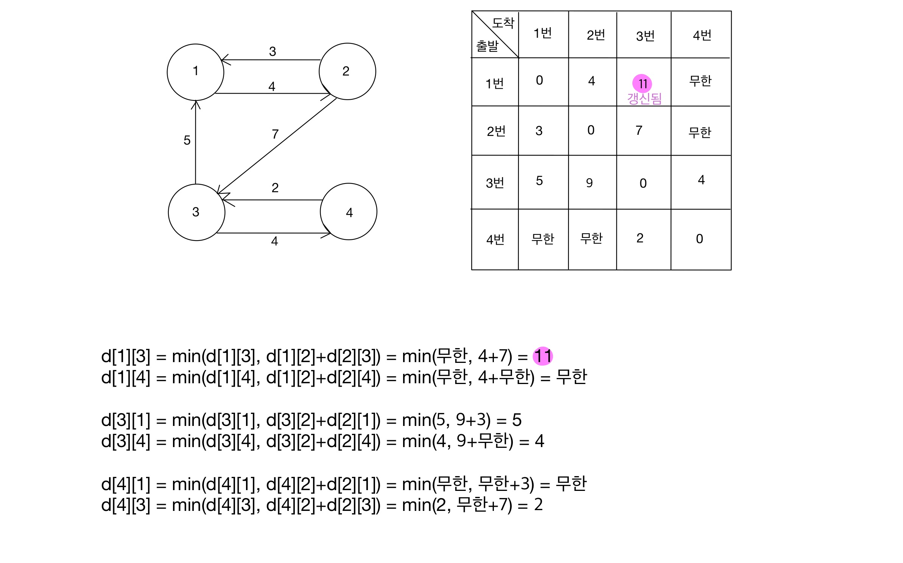
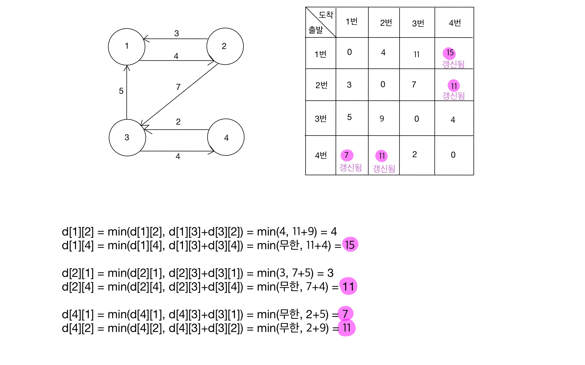
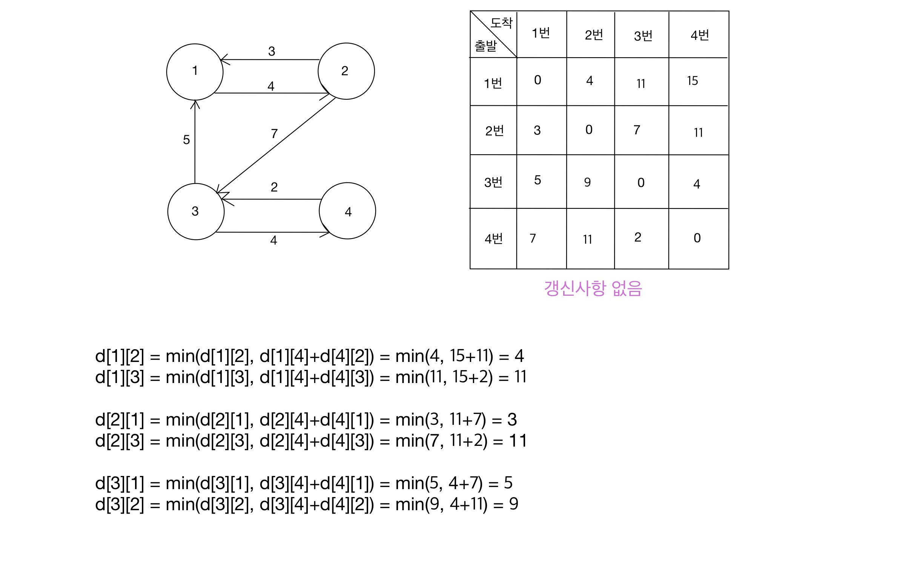

# 플로이드 워셜 알고리즘
## 개요
### 플로이드 워셜 알고리즘이란?
- 모든 지점에서 다른 모든 지점까지의 최단 경로를 모두 구해야 하는 경우에 사용할 수 있는 알고리즘이다.

<br/>

### 다익스트라 vs 플로이드 워셜
- 다익스트라 알고리즘은 단계마다 최단 거리를 가지는 노드를 하나씩 반복적으로 선택한다. 그리고 해당 노드를 거쳐 가는 경로를 확인하며, 최단 거리 테이블을 갱신하는 방식으로 동작한다.
- 플로이드 워셜 알고리즘 또한 단계마다 '거쳐 가는 노드'를 기준으로 알고리즘을 수행한다.
  - **하지만 매번 '방문하지 않은 노드 중에서 최단 거리를 갖는 노드'를 찾을 필요가 없다는 점이 다르다.**
- 다익스트라 알고리즘에서는 출발 노드가 1개이므로 다른 모든 노드까지의 최단 거리를 저장하기 위해서 1차원 리스트를 사용했다.
- 플로이드 워셜 알고리즘은 다익스트라 알고리즘과는 다르게 2차원 리스트에 '최단 거리' 정보를 저장한다는 특징이 있다.  
  **모든 노드에 대하여 다른 모든 노드로 가는 최단 거리 정보를 담아야 하기 때문이다.**
- 다익스트라 알고리즘은 그리디 알고리즘인데, 플로이드 워셜 알고리즘은 다이나믹 프로그래밍이다.
  - 노드의 개수가 N이라고 할 때, N번 만큼의 단계를 반복하며 **'점화식에 맞게'** 2차원 리스트를 갱신하기 때문에 다이나믹 프로그래밍으로 볼 수 있다.

<br/>

### 시간복잡도
- 노드의 개수가 N개일 때 알고리즘상으로 N번의 단계를 수행하며, 단계마다 `O(n^2)`의 연산을 통해 '현재 노드를 거쳐가는' 모든 경로를 고려한다.
- 따라서 플로이드 워셜 알고리즘의 시간 복잡도는 `O(n^3)` 이다.
  - 다시 말해, 2차원 리스트를 처리해야 하므로 N번의 단계에서 매번 `O(N^2)`의 시간이 소요된다.

<br/>

### 동작 개요
> 여기에선 포괄적인 동작에 대해서 설명한다.  
자세한 동작 순서는 문서 아래 예시(그림)를 참고하자.

- 각 단계에서는 해당 노드를 거쳐 가는 경우를 고려한다.
- 예시) 1번 노드에 대해서 확인하는 단계
  - 1번 노드를 중간에 거쳐 지나가는 모든 경우를 고려하면 된다.
    - 즉 `A -> 1번 노드 -> B` 로 가는 비용을 확인한 후에 최단 거리를 갱신한다.
  - 만약 현재 최단 거리 테이블에 `A번 노드에서 B번 노드로 이동하는 비용`이 3으로 기록되어 있을 때,  
    `A번 노드에서 1번 노드를 거쳐 B번 노드로 이동하는 비용`이 2라는 것이 밝혀지면,  
    A번 노드에서 B번 노드로 이동하는 비용을 2로 갱신하는 것이다.
- **따라서 알고리즘에서는 현재 확인하고 있는 노드를 제외하고, N-1개의 노드 중에서 서로 다른 노드 (A, B)쌍을 선택한다.  
  이후에 `A -> 현재 확인하고 있는 노드 -> B`로 가는 비용을 확인한 뒤, 최단 거리를 갱신한다.**
  - 다시 말해  개의 쌍을 단계마다 반복해서 확인하면 된다.  
    이때  는 ) 이라고 볼 수 있기 때문에, 전체 시간 복잡도는
    ) 이라고 할 수 있다.
- **k번째 단계(현재 확인 중인 노드가 k일 때)에 대한 점화식**
  - )
  - 'A에서 B로 가는 최소 비용'과 'A에서 K를 거쳐 B로 가는 비용'을 비교하여 더 작은 값으로 갱신하겠다는 뜻이다.

<br/>

### 플로이드 워셜 알고리즘 동작 방식
1. 최단 거리 테이블을 초기화한다.
2. K번째 노드를 선택하고, 해당 노드에 대해서 아래 점화식을 적용한다.
   - )
3. 모든 노드에 대해 2번을 반복한다.

<br/><br/>

## 동작 예시
### 예시에서 사용할 그래프 형태

> 교재의 그래프와 약간 다르니 주의하자!

<br/>

### Step 01

- 테이블을 초기화한다.
- 존재하지 않는 간선은 무한으로 표현한다.

<br/>

### Step 02 (K = 1)

- 현재 확인 중인 노드(K)가 1일 때, **'1을 제외한 나머지 노드들에 대해 가능한 모든 경로'에 점화식을 적용한다.**


<br/>

### Step 03 (K = 2)

- 현재 확인 중인 노드(K)가 2일 때, **'2을 제외한 나머지 노드들에 대해 가능한 모든 경로'에 점화식을 적용한다.**

<br/>

### Step 04 (K = 3)

- 현재 확인 중인 노드(K)가 3일 때, **'3을 제외한 나머지 노드들에 대해 가능한 모든 경로'에 점화식을 적용한다.**

<br/>

### Step 05 (K = 4)

- 현재 확인 중인 노드(K)가 4일 때, **'4을 제외한 나머지 노드들에 대해 가능한 모든 경로'에 점화식을 적용한다.**

<br/>

## 소스코드
### 플로이드 워셜 알고리즘
```java
package shortestpath;


import java.io.BufferedReader;
import java.io.InputStreamReader;
import java.util.ArrayList;
import java.util.Arrays;
import java.util.StringTokenizer;

public class 플로이드_워셜 {
  static final int INF = (int) 1e9; //무한을 의미하는 값으로 10억을 설정
  static int sizeOfNode;
  static int sizeOfEdge;
  static int[][] graph = new int[501][501]; //그래프


  /**
   * 실행 메서드
   */
  public static void execute() throws Exception {
    BufferedReader bf = new BufferedReader(new InputStreamReader(System.in));
    sizeOfNode = Integer.parseInt(bf.readLine());
    sizeOfEdge = Integer.parseInt(bf.readLine());

    //그래프를 무한으로 초기화
    for (int i = 0; i < graph.length; i++) {
      Arrays.fill(graph[i], INF);
    }

    //자기자신으로 가는 최소 거리는 0이므로 0으로 초기화
    for (int i = 1; i < graph.length; i++) {
      for (int u = 1; u < graph[i].length; u++) {
        if (i == u) graph[i][u] = 0;
      }
    }

    //입력받은 간선 정보로 그래프의 나머지 부분 초기화
    for (int i = 0; i < sizeOfEdge; i++) {
      String s = bf.readLine();
      StringTokenizer st = new StringTokenizer(s);
      int fromNode = Integer.parseInt(st.nextToken());
      int toNode = Integer.parseInt(st.nextToken());
      int distance = Integer.parseInt(st.nextToken());
      graph[fromNode][toNode] = distance;
    }

//    solution1();
    solution2();

    for (int i = 1; i <= sizeOfNode; i++) {
      for (int u = 1; u <= sizeOfNode; u++) {
        if (graph[i][u] >= INF) {
          System.out.print("INFINITE");
        } else {
          System.out.print(graph[i][u] + " ");
        }
      }
      System.out.println();
    }
  }

  /**
   * 플로이드 워셜 수행 메서드
   */
  private static void solution1() {

    for (int k = 1; k <= sizeOfNode; k++) {
      for (int a = 1; a <= sizeOfNode; a++) {
        if (a == k) continue; //k를 제외한 나머지에서 선택해야하므로

        for (int b = 1; b <= sizeOfNode; b++) {
          if (b == k) continue; //k를 제외한 나머지에서 선택해야하므로
          if (b == a) continue; //k를 제외한 노드 중, 같은 노드끼리인 경우는 생략 (거리=0)
          graph[a][b] = Math.min(graph[a][b], graph[a][k]+graph[k][b]);
        } //for문 종료

      } //for문 종료
    } //for문 종료
  }

  /**
   * 플로이드 워셜 수행 메서드 (쓸데없는 if문 제거 ver.)
   */
  private static void solution2() {
    for (int k = 1; k <= sizeOfNode; k++) {
      for (int a = 1; a <= sizeOfNode; a++) {
        for (int b = 1; b <= sizeOfNode; b++) {
          graph[a][b] = Math.min(graph[a][b], graph[a][k]+graph[k][b]);
        }//for문 종료
      }//for문 종료
    }//for문 종료

  }

}

```

- `solution1` 메서드와 `solution2` 메서드의 차이점
  - `solution1` 메서드는 위 문서 내용을 그대로 코드화시켰다.
  - `solution2` 메서드는 로직상 삭제해도 영향이 없는 코드를 삭제했다.
    - 플로이드 워셜 알고리즘에선 원래, 현재 수행 중인 노드(`k`)를 제외한 나머지 노드들 중에서 점화식을 계산해야 한다.
    - 하지만 노드 `k` 를 포함하여 점화식 계산을 수행하더라도, 최소값을 구하는 `min()` 메서드가 존재하기에 문제가 없다.
    - 따라서 `solution2` 메서드에선 필요없는 코드 (`if문` 3개)를 제거했다.