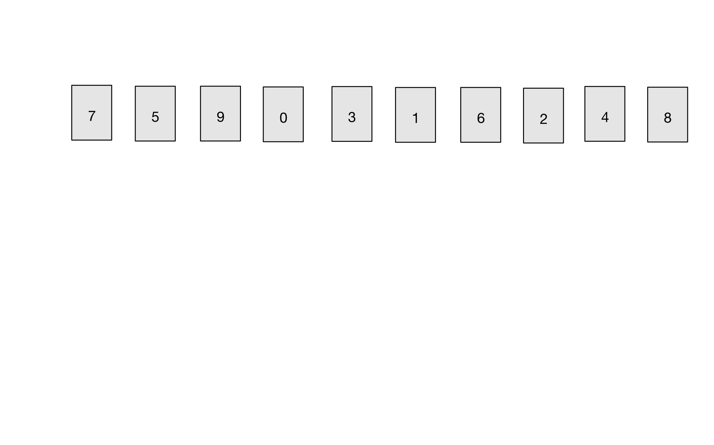
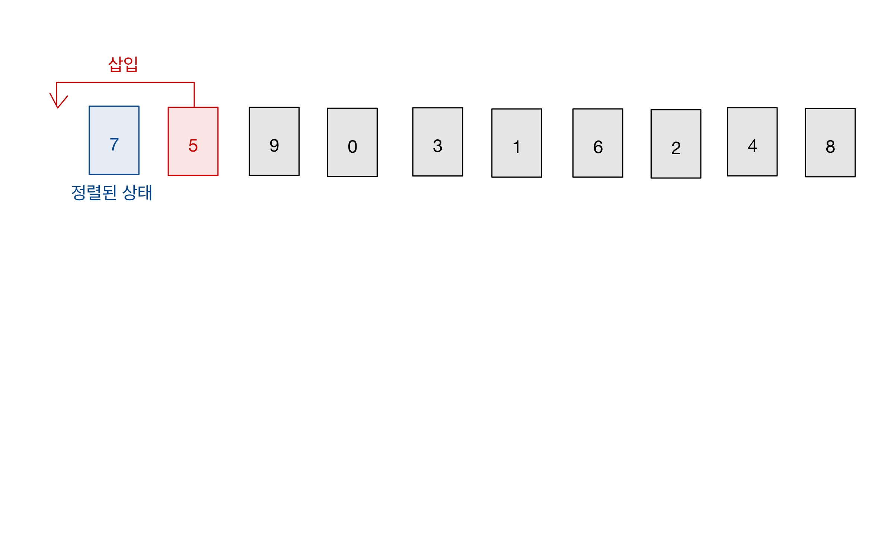
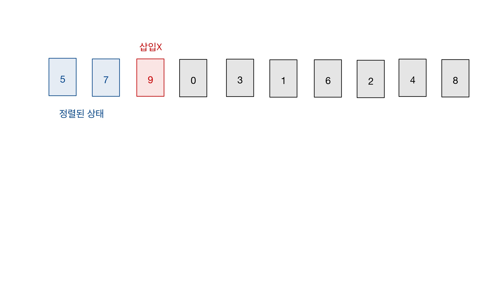
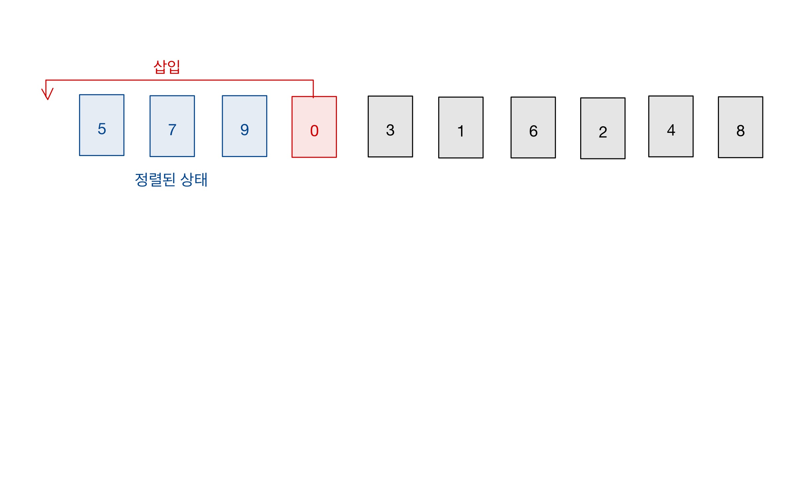
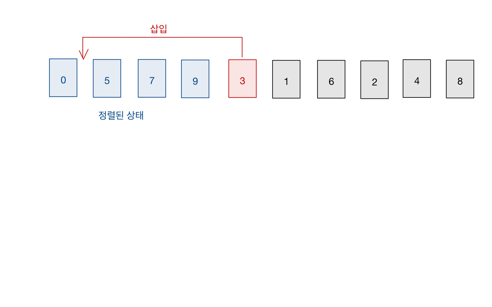
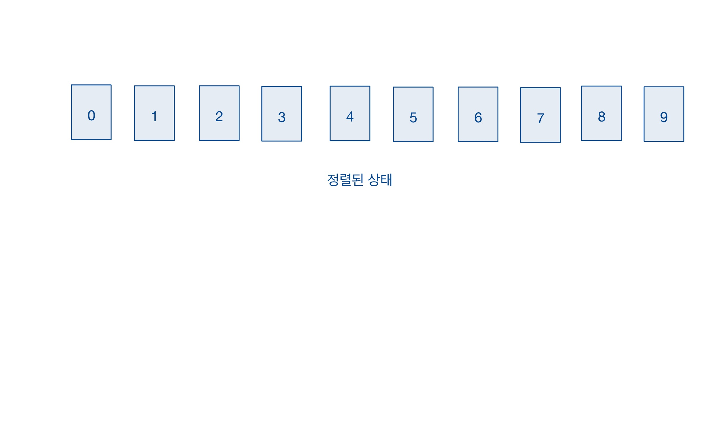

# 삽입정렬
## 개요
### 삽입정렬이란?
- 데이터가 무작위로 여러 개 있을 때, 데이터를 하나씩 확인하며 각 데이터를 적절한 위치에 삽입하는 알고리즘이다.
- 필요할 때만 위치를 바꾸므로 **데이터가 거의 정렬되어 있을 때 훨씬 효율적** 이다.
- 특정한 데이터가 적절한 위치에 들어가기 이전에, 그 앞까지의 데이터는 이미 정렬되어 있다고 가정한다.

### 삽입정렬 동작 과정
1. 앞에서 두번째 수를 선택한다.
2. 선택한 수의 바로 앞의 수와 비교하여, 선택한 수가 작다면 서로 위치를 교체한다.
3. 선택한 수가 더 클 때까지 2번 과정을 반복한다.
4. '선택한 수의 초기 위치' 다음의 수를 선택한다.
5. 2~4번 과정을 반복한다.

### 특징
- 한번 정렬이 이루어진 수끼리는 항상 오름차순을 유지하고 있다.  

## 예시
### 예시에서 사용할 배열 형태


### Step 01


### Step 02


### Step 03


### Step 04


### Step 05 ~ 08
> 생략

### Step 09


### 결과
- 오름차순으로 정렬되었다.
```text
0 -> 1 -> 2 -> 3 -> 4 -> 5 -> 6 -> 7 -> 8 -> 9 -> 10
```

## 소스코드
```java
public class 삽입정렬 {

  private static int[] solution(int[] n) {

    for (int i = 1; i < n.length; i++) { //가장 첫번째 수는 이미 정렬되었다고 취급하므로, 1부터 시작

      int indexOfNowNum = i;

      for (int u = indexOfNowNum - 1; u >= 0; u--) {

        //현재 숫자보다 크다면 멈춘다.
        if (n[u] < n[indexOfNowNum]) {
          break;
        }

        //삽입
        int temp = n[indexOfNowNum];
        n[indexOfNowNum] = n[u];
        n[u] = temp;

        indexOfNowNum--;
      }

    }

    return n;
  }

  public static void execute() {
    Scanner scn = new Scanner(System.in);
    int sizeOfN = scn.nextInt();
    int[] n = new int[sizeOfN];
    scn.nextLine();

    for (int i = 0; i < sizeOfN; i++) {
      n[i] = scn.nextInt();
    }

    TimeCheck.start();

    int[] answer = solution(n);
    for (int i : answer) {
      System.out.println(i + " ");
    }

    TimeCheck.end();
  }
}

```

## 시간복잡도
- 수의 길이만큼 아래 반복문을 반복한다.
- '선택한 수'와 '선택한 수의 앞쪽 수들' 을 하나씩 반복하여 비교하여, 적절한 위치를 찾아 삽입한다.
- 그러므로 삽입 정렬의 시간복잡도는 `O(n^2)`이다.
- 하지만 거의 정렬이 되어있는 상태라면(최선의 경우), 시간복잡도는 `O(n)` 이다.