# 선택정렬
## 개요
### 선택정렬이란?
- 데이터가 무작위로 여러 개 있을 때, 이 중에서 가장 작은 데이터를 선택해 맨 앞에 있는 데이터와 바꾸고, 그 다음 작은 데이터를 선택해 앞에서 두번째 데이터와 바꾸는 과정을 반복하는 알고리즘이다.
- 무작위 수를 정렬하는 가장 원시적인 방법이다.

### 선택정렬 동작 과정
1. 가장 작은 수를 선택하고, 해당 수와 첫번째 수를 서로 교체한다. 
2. 이제 첫번째 수는 정렬되었으므로, 고정된다.
3. 고정되지 않은 수들 중 가장 작은 수를 선택하고, 고정되지 않은 수들 중 가장 앞에 있는 수와 교체한다.
4. (n-1) 번 반복한다.
    - n: 전체 숫자의 개수
    - n-1번 반복하는 이유: n-1개의 숫자들이 고정되었다면, 자연스럽게 가장 마지막 숫자는 가장 큰 수이므로 굳이 계산하지 않아도 된다.

## 예시
### 예시에서 사용할 배열 형태
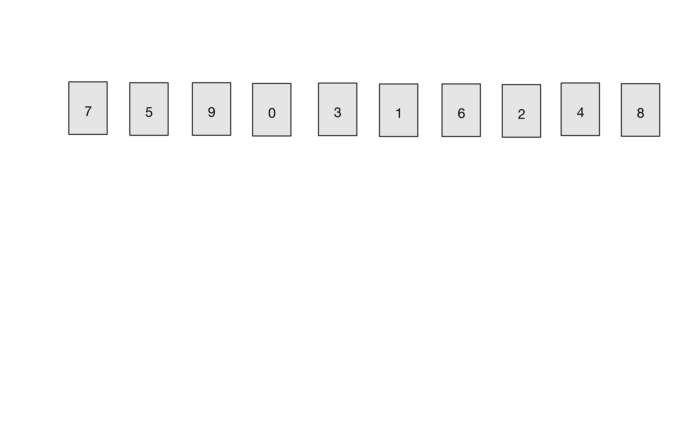

### Step 01
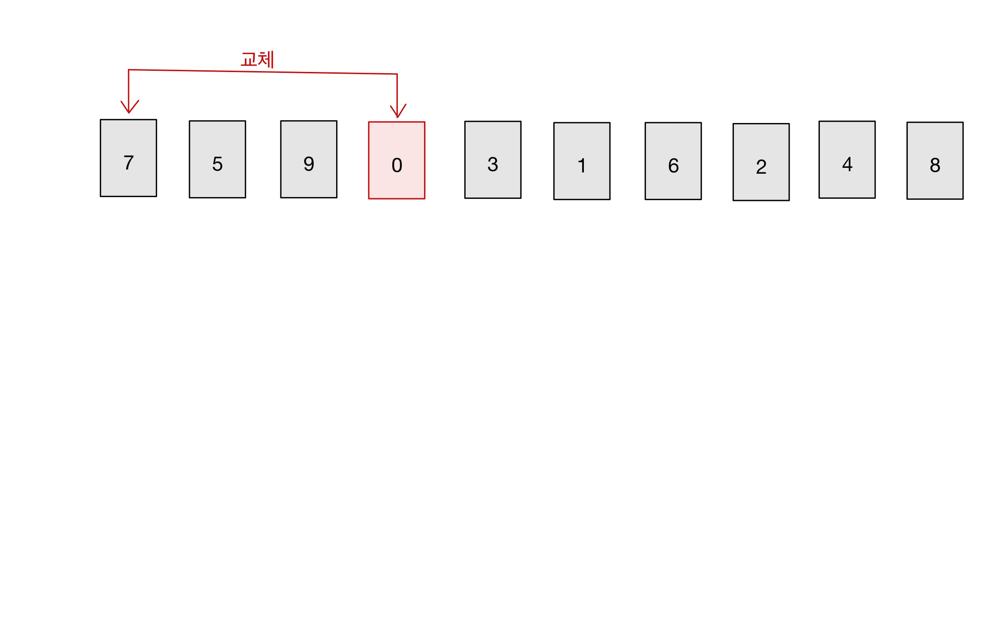

### Step 02
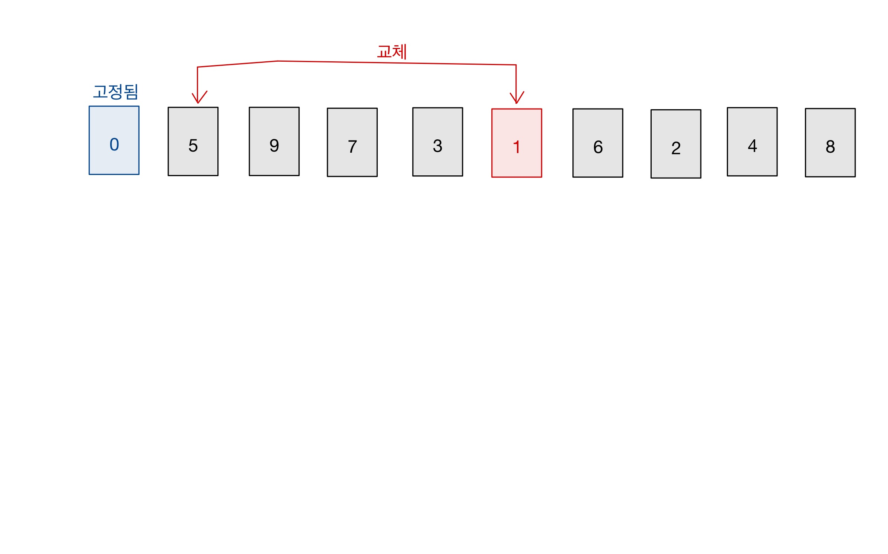

### Step 03
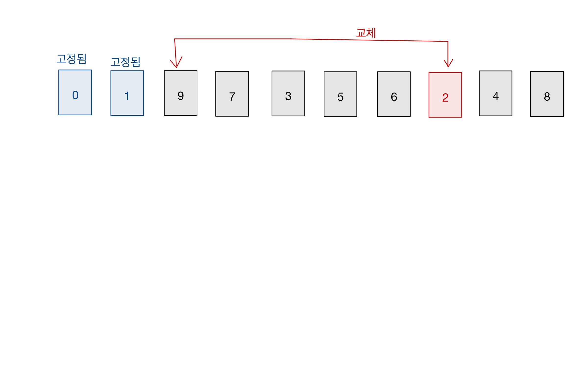

### Step 04
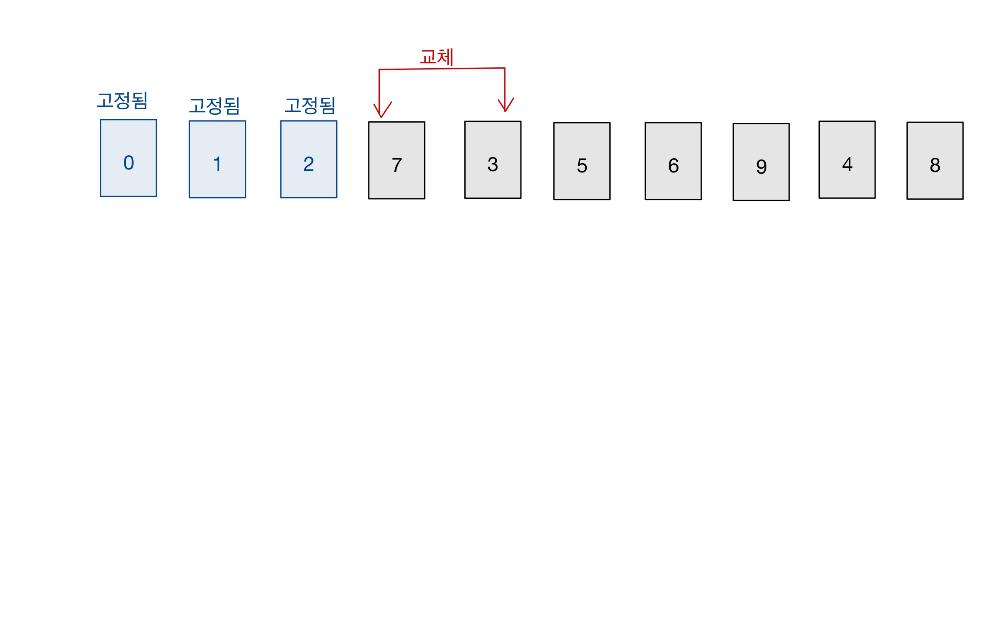

### Step 05
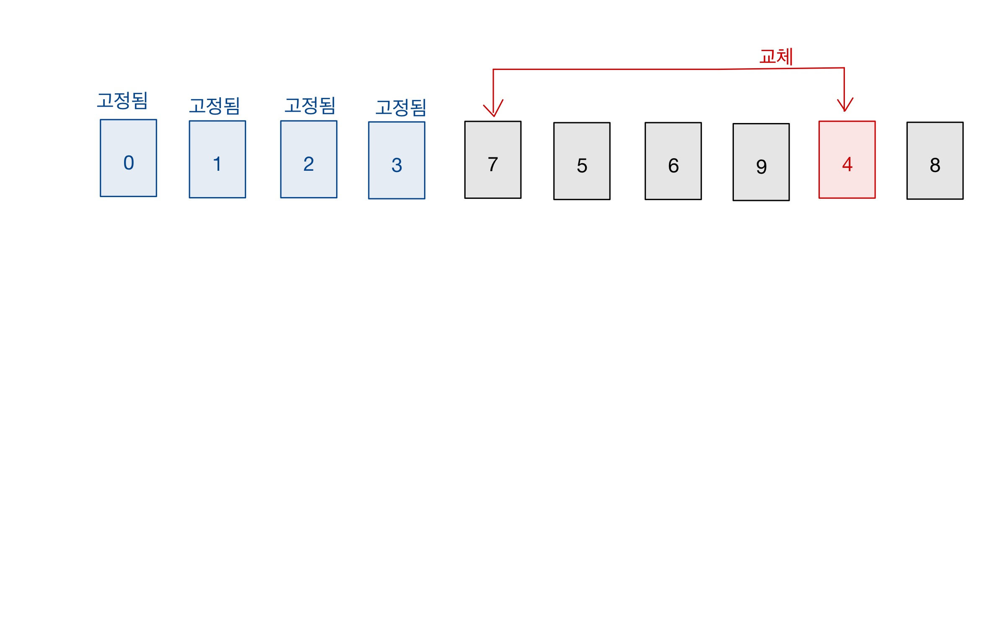

### Step 06
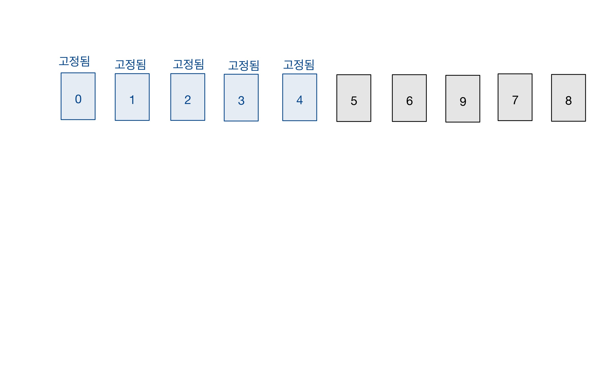

### Step 07
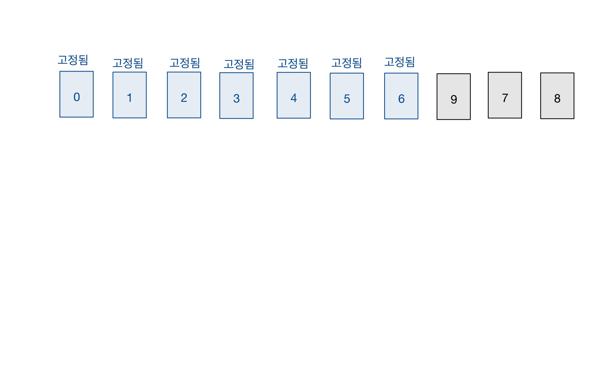

### Step 08
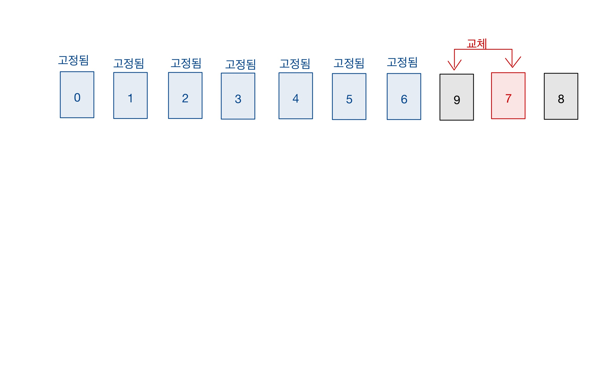

### Step 09
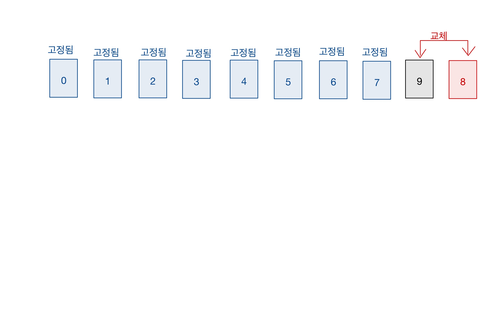

### Step 10
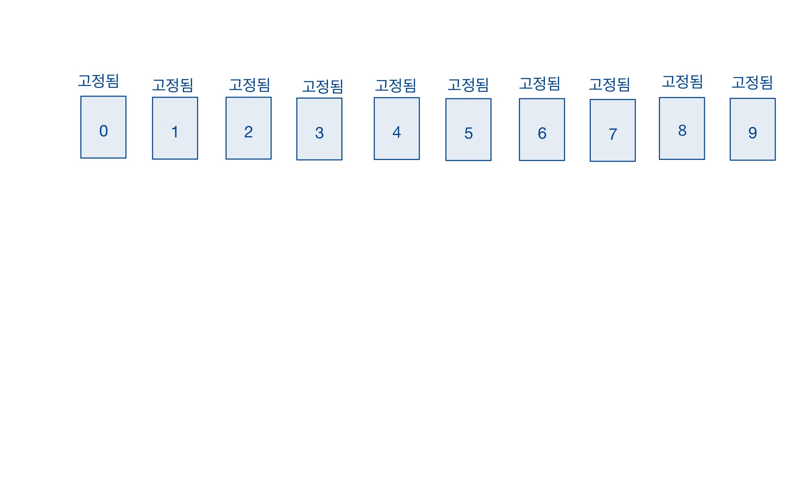

### 결과
- 오름차순으로 정렬되었다.
```text
0 -> 1 -> 2 -> 3 -> 4 -> 5 -> 6 -> 7 -> 8 -> 9 -> 10
```

## 소스코드
```java
public class 선택정렬 {

  private static int[] solution(int[] n) {
    int indexOfLastSortedNum = -1; //정렬된 숫자를 기억하기 위한 변수

    while (indexOfLastSortedNum < n.length-1) {


      //정렬되지 않은 수들 중 가장 작은 것 선택
      int indexOfSmallestNum = indexOfLastSortedNum+1; //초기화
      for (int i = indexOfLastSortedNum + 2; i < n.length; i++) {
        if (n[indexOfSmallestNum] > n[i]) {
          indexOfSmallestNum = i;
        }
      }

      //정렬되지 않은 수들 중, '선택된 것'과 '가장 앞에 있는 것'을 서로 교체한다.
      int temp = n[indexOfLastSortedNum+1];
      n[indexOfLastSortedNum+1] = n[indexOfSmallestNum];
      n[indexOfSmallestNum] = temp;

      //업데이트
      indexOfLastSortedNum++;
    }

    return n;
  }

  /**
   * 실행 메서드
   */
  public static void execute() {
    Scanner scn = new Scanner(System.in);
    int sizeOfN = scn.nextInt();
    int[] n = new int[sizeOfN];
    scn.nextLine();

    for (int i = 0; i < sizeOfN; i++) {
      n[i] = scn.nextInt();
    }

    TimeCheck.start();
    int[] answer = solution(n);
    TimeCheck.end();

    for (int i : answer) {
      System.out.print(i + " ");
    }
  }
}
```

## 시간복잡도
- 고정되지 않은 수 중에서 가장 작은 숫자를 찾아, 고정되지 않은 수들 중 가장 앞에 위치한 수오 교체한다.
- 고정되지 않은 수 중에서 가장 작은 숫자를 찾는 연산의 횟수를 수식으로 나타내면 아래와 같다.
  ```text
  (n) + (n-1) + (n-2) + ... + 2
  
  이때 n은 고정되지 않은 수의 개수를 뜻한다.
  ```
- 따라서 선택정렬의 시간복잡도는 `O(n^2)` 이다.